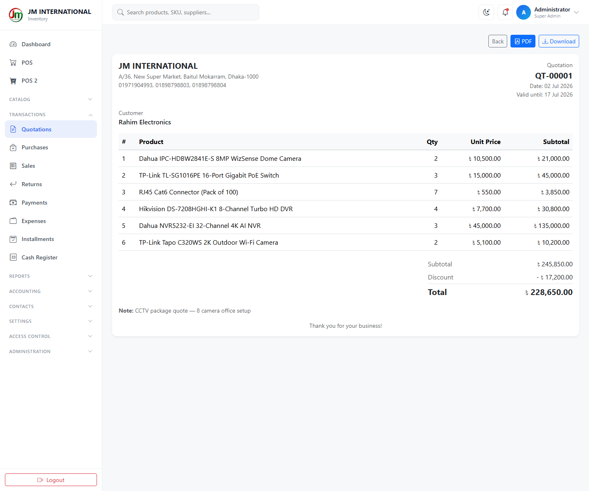
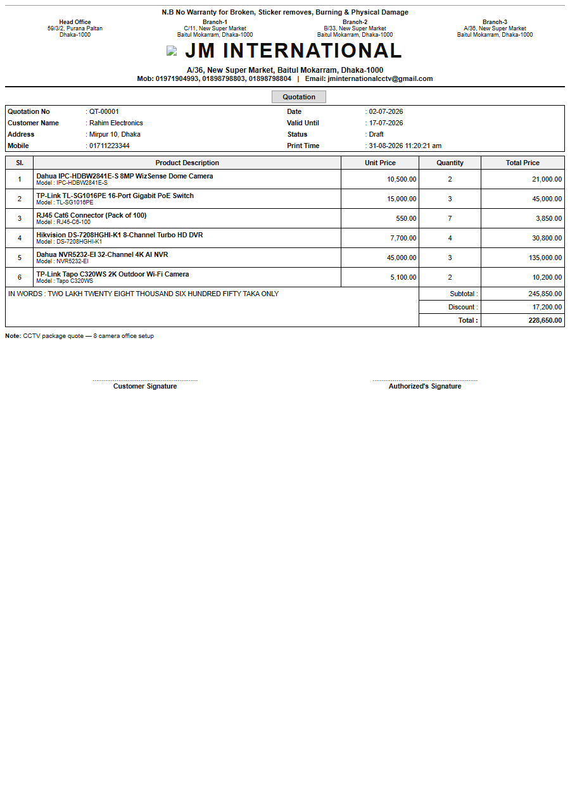
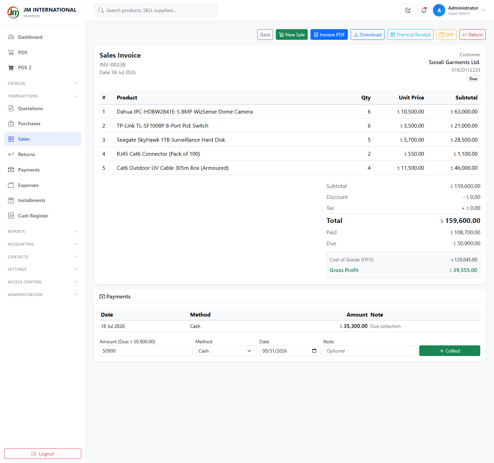
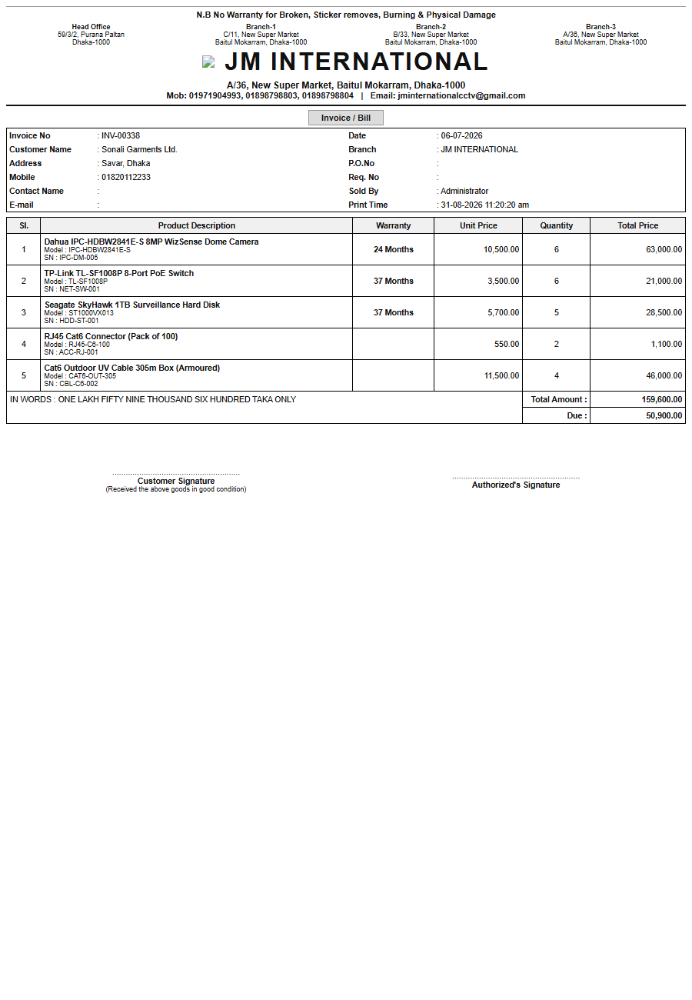
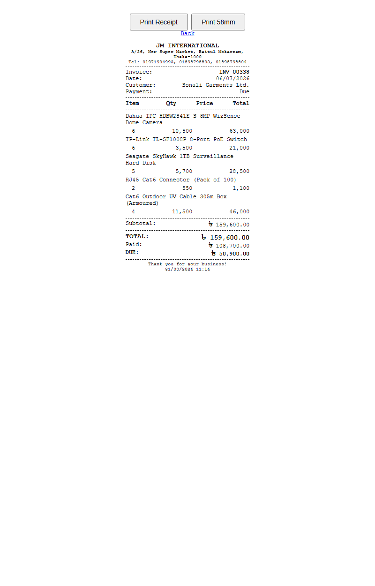
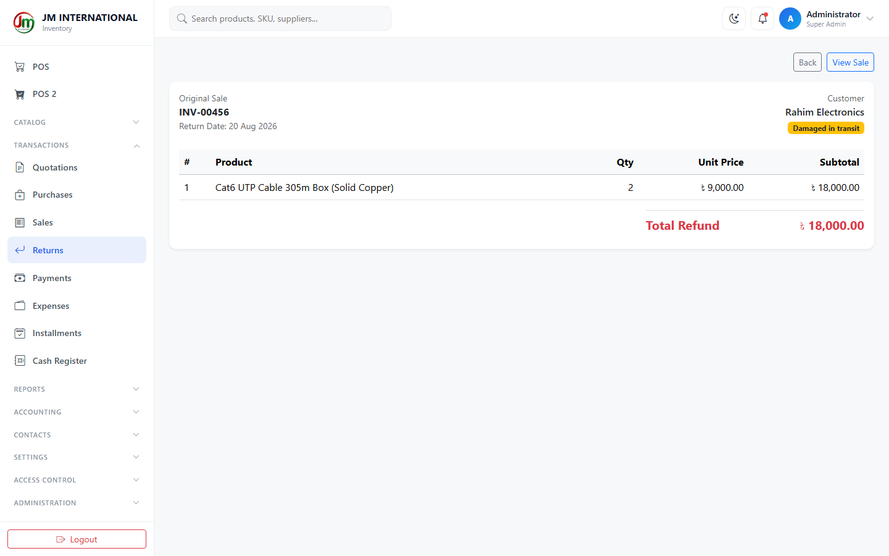
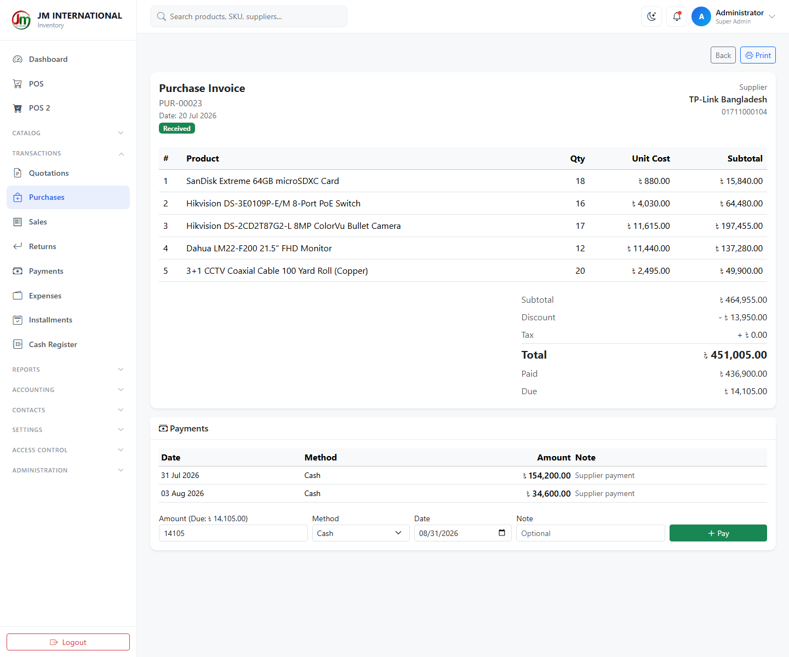
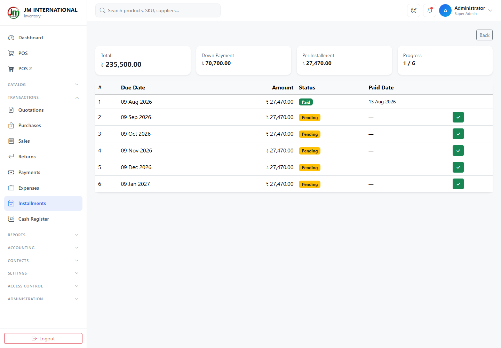

# JM INTERNATIONAL — ব্যবহারের নিয়ম

সিসিটিভি দোকানের ইনভেন্টরি ও বিক্রির সফটওয়্যার। প্রতিটা স্ক্রিন ছবি দিয়ে দেখানো হয়েছে।

নিচের সব ছবি এই সফটওয়্যার থেকেই তোলা — ৬৩টা প্রোডাক্ট, ৩০টা ক্যাটাগরি, আর দুই মাসের নমুনা লেনদেন সহ (১৬০টা বিক্রি, ৯টা পারচেজ, ফেরত, পেমেন্ট, খরচ, কোটেশন, কিস্তি আর ক্যাশ রেজিস্টারের শিফট)। তাই চার্ট, খাতা আর রিপোর্টে আসল ও মিলে যাওয়া হিসাব দেখতে পাবেন।

> এই নমুনা ডেটা তৈরি হয় `php artisan app:seed-demo-transactions --fresh` দিয়ে। আসল ব্যবসা শুরু করার সময় এগুলো মুছে ফেলবেন — [পরিশিষ্ট ঘ](#a4) দেখুন।

> 🇬🇧 English version: **[USER-MANUAL.md](USER-MANUAL.md)**

---

## সূচিপত্র

| # | বিষয় | # | বিষয় |
|---|------|---|------|
| ১ | [লগইন করা](#s1) | ৮ | [পারচেজ (মাল কেনা)](#s8) |
| ২ | [স্ক্রিন চেনা](#s2) | ৯ | [টাকা আসা-যাওয়া](#s9) |
| ৩ | [ড্যাশবোর্ড](#s3) | ১০ | [রিপোর্ট](#s10) |
| ৪ | [প্রোডাক্ট](#s4) | ১১ | [হিসাব](#s11) |
| ৫ | [ক্যাটাগরি ও ইউনিট](#s5) | ১২ | [কাস্টমার ও সাপ্লায়ার](#s12) |
| ৬ | [স্টক](#s6) | ১৩ | [ইউজার ও পারমিশন](#s13) |
| ৭ | [বিক্রি করা](#s7) | ১৪ | [সেটিংস](#s14) |

শেষে: [FIFO কী](#a1) · [বারকোড](#a2) · [সমস্যা হলে](#a3) · [নমুনা ডেটা](#a4)

---

<a id="s1"></a>

## ১. লগইন করা


ব্রাউজারে সফটওয়্যার খুলে ইমেইল আর পাসওয়ার্ড দিয়ে ঢুকুন।

শুরুতে দুইটা আইডি দেওয়া থাকে:

| কে | ইমেইল | পাসওয়ার্ড |
|----|-------|-----------|
| মালিক / অ্যাডমিন | `admin@example.com` | `password` |
| সেলসম্যান | `cashier@example.com` | `password` |

> ⚠️ **দোকান চালু করার আগেই দুইটা পাসওয়ার্ডই বদলে ফেলুন।** এই পাসওয়ার্ড সবাই জানে — না বদলালে যে কেউ আপনার স্টক, দাম আর বিক্রির হিসাব দেখে ফেলতে পারবে। বদলাবেন **Profile → Change Password** থেকে (১৪ নম্বর অংশ দেখুন)।

কে কখন কোন কম্পিউটার থেকে ঢুকল — সব **Login History**-তে জমা থাকে।

---

<a id="s2"></a>

## ২. স্ক্রিন চেনা

স্ক্রিন তিন ভাগে ভাগ করা।

**বাঁ পাশের মেনু** — এখানে সব স্ক্রিন আছে, দলে দলে সাজানো। দলের নামে ক্লিক করলে খোলে-বন্ধ হয়:

| দল | ভেতরে যা আছে |
|----|--------------|
| *(উপরে, সবসময় খোলা)* | Dashboard · POS · POS 2 |
| **Catalog** | Products · Categories · Stock · Batches |
| **Transactions** | Quotations · Purchases · Sales · Returns · Payments · Expenses · Installments · Cash Register |
| **Reports** | Sales & Profit · Daily Summary · Top Products · Purchases · Stock Valuation · Profit & Loss |
| **Accounting** | Day Book · Trial Balance |
| **Contacts** | Suppliers · Customers |
| **Settings** | Unit · Main Category · Category · Sub Category |
| **Access Control** | Users · Roles · Permissions |
| **Administration** | Branches · Login History · Activity Log · Settings · User Manual |

যে স্ক্রিনে ঢোকার অনুমতি আপনার নেই, সেটা মেনুতেই দেখাবে না। তাই সেলসম্যানের মেনু অ্যাডমিনের চেয়ে অনেক ছোট — এটা সমস্যা না, এভাবেই বানানো।

**উপরের বার** — সার্চ বক্স (প্রোডাক্ট, SKU, সাপ্লায়ার খোঁজা যায়), চাঁদ/সূর্য বোতাম (দিনের-রাতের রঙ বদলায়), ঘণ্টা (স্টক অ্যালার্টে নিয়ে যায়), আর আপনার নাম।

দুইটা কাজের কথা:

- **রঙ মনে রাখে।** আপনি ডার্ক মোড দিলে সেটা আপনার ব্রাউজারে জমা থাকে, লগআউট করলেও থাকে। অন্য কারো স্ক্রিনে বদলায় না।
- **লম্বা লিস্ট নিজে নিজেই লোড হয়।** প্রোডাক্ট বা স্টকের লিস্টে নিচে স্ক্রল করলেই পরের অংশ চলে আসে — ১, ২, ৩ পেজ নম্বরে চাপ দিতে হয় না।

---

<a id="s3"></a>

## ৩. ড্যাশবোর্ড


লগইন করলেই এই স্ক্রিন আসে। উপরে চারটা সংখ্যা:

| বক্স | মানে কী |
|------|---------|
| **Total products** | মোট কতগুলো প্রোডাক্ট আছে, কত ক্যাটাগরিতে |
| **Stock value** | দোকানে যে মাল আছে তার **কেনা দাম** — বিক্রির দাম না |
| **Today's sales** | আজকের বিক্রি আর কয়টা বিল হলো |
| **Low stock** | কয়টা মাল শেষ হয়ে আসছে |

নিচে — গত ৭ দিনের বিক্রির চার্ট, কোন ক্যাটাগরিতে বেশি বিক্রি, কোন মাল ফুরিয়ে আসছে তার তালিকা, আর সর্বশেষ বিল। **New sale** বোতামে চাপ দিলে সরাসরি POS-এ চলে যাবেন।

ছবির সংখ্যাগুলো নমুনা লেনদেন থেকে আসা, তাই চার্টে আসল বিক্রির ওঠানামা দেখা যাচ্ছে আর "স্টক কম" তালিকায় সেই মালগুলোই আছে যেগুলো নমুনা বিক্রিতে কমে গেছে।

---

<a id="s4"></a>

## ৪. প্রোডাক্ট

### প্রোডাক্টের লিস্ট


সব প্রোডাক্ট — ছবি, মডেল নম্বর, ক্যাটাগরি আর চালু/বন্ধ অবস্থা সহ। উপরের সার্চ বক্সে নাম বা মডেল লিখে খুঁজতে পারবেন, পাশের দুইটা ড্রপডাউন দিয়ে ক্যাটাগরি আর স্ট্যাটাস অনুযায়ী ছাঁকতে পারবেন। **Reset** দিলে সব ছাঁকনি উঠে যায়।

ডান পাশের পেন্সিলে চাপ দিলে প্রোডাক্ট এডিট হয়, লাল বিনে চাপ দিলে মুছে যায়।

### একটা প্রোডাক্টের বিস্তারিত


প্রোডাক্টের নামে ক্লিক করলে সব তথ্য এক পাতায়: ছবি, মডেল, SKU, বারকোড, ক্যাটাগরি, কবে যোগ হয়েছে — সাথে ছাপার উপযোগী বারকোড লেবেল আর লেখা বিবরণ।

নিচের দিকে **স্টক ব্যাচ** — কোন চালানে কবে কয়টা মাল এসেছিল, কত দামে, আর এখন কয়টা বাকি আছে। এটাই FIFO-র হিসাব ([নিচে দেখুন](#a1))।

### নতুন প্রোডাক্ট যোগ করা / এডিট করা


জরুরি ঘরগুলো:

| ঘর | কী লিখবেন |
|----|-----------|
| **Name, Model, SKU** | নাম দিতেই হবে। SKU আপনার নিজের কোড — যেমন `IPC-BL-001` |
| **Purchase / Sale price** | কত টাকায় কিনলেন আর কত টাকায় বেচবেন। লাভের হিসাব এখান থেকেই হয় |
| **Opening stock** | শুধু নতুন প্রোডাক্টে আসে। পরে স্টক বদলাবে কেনা-বেচা আর অ্যাডজাস্টমেন্ট দিয়ে |
| **Alert quantity** | কত পিসের নিচে নামলে "স্টক কম" সতর্কতা দেখাবে |
| **Unit** | `pcs`, `box`, `roll`, `pack`, `set`, `yard` — যা মানায় |
| **Warranty (days)** | কত দিনের গ্যারান্টি। বিক্রির সময় নিজে নিজেই মেয়াদের তারিখ বসে যাবে। `0` মানে গ্যারান্টি নেই |
| **Image URL** | ছবির ওয়েব লিংক — ফাইল আপলোড না। লিংক বসালেই পাশে ছবি দেখাবে |
| **বিবরণের ঘরগুলো** | Short description, Description, Advantages, Specifications — এখানে বোল্ড, বুলেট সব দেওয়া যায় |

বারকোড আপনাকে লিখতে হবে না — প্রোডাক্ট সেভ করলেই নিজে নিজে তৈরি হয়ে যায়।

### বারকোড লেবেল ছাপা


প্রোডাক্ট বেছে দামের লেবেল ছাপুন — A4 কাগজে বা থার্মাল প্রিন্টারে। প্রোডাক্টের পাতা থেকে **Print Batch Labels** দিলে প্রতিটা চালানের আলাদা লেবেল ছাপা যায়, তাতে পুরনো-নতুন মাল আলাদা চেনা যায়।

### একসাথে অনেক দাম বদলানো


একটা একটা করে না খুলে এক স্ক্রিনেই অনেক প্রোডাক্টের কেনা-বেচার দাম বদলানো যায়। সাপ্লায়ার দাম বাড়ালে এটাই সবচেয়ে দ্রুত উপায়।

### এক্সেল থেকে প্রোডাক্ট তোলা


এক্সেল ফাইল আপলোড করে একসাথে অনেক প্রোডাক্ট যোগ বা আপডেট করা যায়। আগে **টেমপ্লেট ফাইলটা নামিয়ে নিন** — ওতে ঠিক যে কলামগুলো লাগবে সেগুলো দেওয়া আছে।

---

<a id="s5"></a>

## ৫. ক্যাটাগরি ও ইউনিট

### ক্যাটাগরি


ক্যাটাগরি তিন ধাপে সাজানো: **Main Category → Category → Sub Category**। যেমন `CCTV Camera → IP Camera → Bullet Camera`।

মেনুর **Settings** দলে আলাদা আলাদা ধাপের শর্টকাট আছে — পুরো তালিকা না ঘেঁটে সরাসরি এক ধাপ দেখতে সুবিধা।

যে ক্যাটাগরিতে প্রোডাক্ট আছে সেটা মোছা যাবে না। আগে প্রোডাক্টগুলো অন্য ক্যাটাগরিতে সরান।

### ইউনিট


প্রোডাক্টের মাপের একক। শুরুতেই দেওয়া আছে — Piece, Box, Set, Pack, Roll, Yard। দরকার হলে নতুন যোগ করুন।

---

<a id="s6"></a>

## ৬. স্টক

### স্টকের অবস্থা


দোকানে কী কতটা আছে তার আসল হিসাব। উপরে তিনটা সংখ্যা — মোট কত পিস মাল, তার কেনা দামে মোট মূল্য, আর কয়টা মাল কম পড়েছে। নিচে প্রতিটা প্রোডাক্টের পরিমাণ, অ্যালার্ট লেভেল, কেনা দাম আর মোট মূল্য।

**Low stock only** টিক দিলে শুধু যেগুলো আনতে হবে সেগুলো দেখাবে।

যে কোনো লাইনের **Adjust** বোতামে চাপ দিয়ে স্টক ঠিক করা যায় — বাড়ানো, কমানো, বা নির্দিষ্ট সংখ্যা বসানো, সাথে কারণ লেখার ঘর। মাল ভাঙলে, চুরি গেলে বা গুনে দেখে গরমিল পেলে এটা ব্যবহার করুন। **বিক্রি বা কেনার জন্য এটা ব্যবহার করবেন না** — ওগুলোর আলাদা স্ক্রিন আছে।

### স্টকের সব নড়াচড়া


কোন মাল কখন কেন বাড়ল বা কমল — সবকিছুর তালিকা। কেনা, বেচা, ফেরত, অ্যাডজাস্ট — সব এখানে লেখা থাকে, সাথে তখনকার মোট ব্যালান্স। স্টকের কোনো পরিবর্তন এই তালিকা ফাঁকি দিয়ে হতে পারে না।

তাই **স্টকের হিসাব না মিললে সবার আগে এই স্ক্রিনটা দেখুন।**

### ব্যাচ


সব প্রোডাক্টের সব চালান এক জায়গায় — কবে এসেছে, কত দামে, এখন কয়টা বাকি। শেলফে যে মালগুলো পড়ে আছে সেগুলোর আসল কেনা দাম দেখতে এখানে আসুন।

---

<a id="s7"></a>

## ৭. বিক্রি করা

### POS (বিক্রির স্ক্রিন)


দোকানের প্রধান স্ক্রিন। কাজের ধাপ:

১. **মাল যোগ করুন।** উপরের ঘরে বারকোড স্ক্যান করে Enter চাপুন, অথবা সার্চ বক্সে নাম লিখুন, অথবা নিচের ছবিতে ক্লিক করুন। ব্যাচের বারকোডও কাজ করে।
২. **পরিমাণ ঠিক করুন** ডান পাশের কার্টে। স্টকে যত আছে তার বেশি বিক্রি করতে দেবে না।
৩. **কাস্টমার বাছুন।** সাধারণত Walk-in Customer থাকে। নতুন কাস্টমার হলে পাশের মানুষ-আইকনে চাপ দিয়ে স্ক্রিন না ছেড়েই যোগ করে ফেলুন।
৪. **ডিসকাউন্ট, ট্যাক্স আর কত টাকা দিল লিখুন।** লিখতে লিখতেই মোট আর ফেরত হিসাব হয়ে যাবে। কম টাকা দিলে বাকিটা **লাল রঙে "Due"** দেখাবে।
৫. **Complete Sale** চাপুন।

বিল হয়ে গেলে সফটওয়্যার নিজেই — স্টক কমাবে (পুরনো মাল আগে), গ্যারান্টির মেয়াদ বসাবে, লয়ালটি পয়েন্ট দেবে (চালু থাকলে), আর বিল ও রসিদ তৈরি করবে।

### POS 2


বিক্রির আরেকটা স্ক্রিন। এখানে শুরুতে কোনো প্রোডাক্ট দেখায় না — খুঁজলে তবেই আসে। প্রোডাক্ট অনেক বেশি হলে বা স্ক্রিন ছোট হলে এটা সুবিধাজনক। কার্ট আর বিল করার নিয়ম একদম একই।

### কোটেশন (দরপত্র)


কাস্টমার এখনো কিনবে কি না ঠিক করেনি — তাকে দাম লিখে দেওয়ার জন্য। সিসিটিভি লাগানোর কাজে এটা খুব দরকার হয়। মাল আর পরিমাণ বসালে মোট নিজে নিজেই হিসাব হয়। PDF করে দেওয়া যায়।

**কোটেশনে স্টক কমে না** — এটা শুধু দাম জানানোর কাগজ।

পাঠানোর আগে খুলে সব লাইন আর মোট মিলিয়ে নিন:



কাস্টমার যে PDF পাবে, তাতে আপনার দোকানের হেডার, প্রতিটা মালের দাম আর মেয়াদের তারিখ থাকে:



### বিক্রির তালিকা


সব বিল এক জায়গায় — কত টাকার বিক্রি, কত পাওয়া গেছে আর কত বাকি।

যে কোনো বিল খুললে পুরো ছবি পাবেন:



এই স্ক্রিনটা ভালো করে চিনে রাখুন:

- কী কী বিক্রি হয়েছে, ছাড়, ট্যাক্স আর মোট টাকা।
- **Cost of Goods (FIFO)** আর **Gross Profit** — ঠিক ওই মালগুলো কিনতে কত খরচ হয়েছিল, আর এই বিক্রিতে আসলে কত লাভ হলো।
- **Payments** — কবে কত টাকা পাওয়া গেছে তার তালিকা, আর বাকি টাকা তোলার জন্য **Collect** ঘর।
- উপরের বোতামগুলো: **Invoice PDF**, **Download**, **Thermal Receipt**, **EMI** (কিস্তিতে ভাগ করা) আর **Return** (ফেরত)।

**Invoice PDF** চাপলে A4 বিল তৈরি হয় — এটাই কাস্টমারকে দেবেন:



এতে আপনার ব্রাঞ্চের ঠিকানা, কাস্টমারের তথ্য, প্রতিটা মালের গ্যারান্টি কত মাস, টাকার অঙ্ক কথায়, আর বাকি টাকা — সব থাকে। (উপরের ছবিতে লোগো দেখা যাচ্ছে না শুধু এই প্রিভিউটা ব্রাউজারে তোলার কারণে; আসল PDF-এ লোগো থাকে।)

**Thermal Receipt** হলো কাউন্টারের ছোট রসিদ, ৫৮ বা ৮০ মিলিমিটার প্রিন্টারের মাপে:



### ফেরত


কাস্টমার মাল ফেরত দিলে এখানে লিখুন। ফেরত দিলে **স্টক আবার বেড়ে যায়** আর বিক্রির হিসাব থেকে টাকাটা বাদ যায় — তাই লাভের হিসাব ঠিক থাকে।

প্রতিটা ফেরতে লেখা থাকে কোন বিল থেকে এসেছে, কী ফেরত এসেছে আর কেন:



ওই বিলে যত মাল বিক্রি হয়েছে তার বেশি ফেরত নিতে দেবে না।

---

<a id="s8"></a>

## ৮. পারচেজ (মাল কেনা)


দোকানে মাল ঢোকানোর স্ক্রিন। সাপ্লায়ার বাছুন, প্রোডাক্ট আর পরিমাণ-দাম বসান, সেভ করুন।

সেভ করলেই **নতুন একটা FIFO ব্যাচ তৈরি হয়** ঠিক যে দাম আপনি লিখেছেন সেই দামে। এখানেই আসল কথাটা:

> ⚠️ **কেনা দাম ভুল লিখলে ওই মালগুলোর লাভের হিসাব চিরকাল ভুল থাকবে।** সেভ করার আগে দামটা একবার মিলিয়ে নিন।

কোনো পারচেজ খুললে দেখা যায় কী কী এসেছে, কত দামে, আর কত টাকা বাকি:



পুরো টাকা একসাথে না দিলে বাকিটা সাপ্লায়ারের নামে জমা থাকে, পরে **Payments** থেকে শোধ করা যায়।

---

<a id="s9"></a>

## ৯. টাকা আসা-যাওয়া

### পেমেন্ট


বাকিতে বিক্রি করা টাকা তোলা, আর সাপ্লায়ারকে টাকা দেওয়া — দুইটাই এখানে।

আংশিক টাকাও নেওয়া যায়। যেমন ১২,০০০ টাকার বিলে কাস্টমার ৫,০০০ দিলে বাকি ৭,০০০ তার নামে জমা থাকবে, তার লেজারে দেখা যাবে।

### কিস্তি


কোনো বিক্রিকে মাসিক কিস্তিতে ভাগ করা যায়। সফটওয়্যার নিজেই তারিখ ধরে কিস্তির তালিকা বানিয়ে দেয়, আর কোনটা দেওয়া হয়েছে, কোনটা বাকি, কোনটার তারিখ পার হয়ে গেছে — সব দেখায়।

কোনো প্ল্যান খুললে পুরো তালিকা দেখা যায়, আর টাকা পেলে সেখানেই দাগ দেওয়া যায়:



### খরচ


দোকান ভাড়া, বিদ্যুৎ বিল, কর্মচারীর বেতন, গাড়ি ভাড়া, যন্ত্রপাতি — সব খরচ এখানে লিখুন। খরচের ধরন নিজেই বানিয়ে নিতে পারবেন।

> লাভের হিসাব থেকে এই খরচগুলো বাদ যায়। **তাই যে খরচ এখানে লিখবেন না, সেটা আপনার লাভকে মিথ্যাভাবে বাড়িয়ে দেখাবে।**

### ক্যাশ রেজিস্টার


দিন শুরুতে ক্যাশে কত টাকা আছে লিখে শিফট খুলুন, দিন শেষে গুনে কত পেলেন লিখে বন্ধ করুন। সফটওয়্যার দেখাবে কত থাকার কথা ছিল আর কত পাওয়া গেল। **টাকা কম-বেশি হলে সেদিনই ধরা পড়বে**, মাস শেষে না।

---

<a id="s10"></a>

## ১০. রিপোর্ট

ছয়টা রিপোর্ট। সবগুলোতেই তারিখ বেছে নেওয়া যায় এবং ছাপা যায়।

### বিক্রি ও লাভ


প্রতিটা বিক্রিতে কত টাকা এলো, মাল কিনতে কত খরচ হয়েছিল, আর লাভ কত শতাংশ।

খরচের হিসাব আসে **ঠিক যে ব্যাচের মাল বিক্রি হয়েছে সেই ব্যাচের দাম থেকে** — আজকের কেনা দাম থেকে না। তাই সংখ্যাটা সত্যিকারের লাভ দেখায়।

### দৈনিক হিসাব


দিন ধরে ধরে বিক্রি। এই সপ্তাহ আর গত সপ্তাহ মেলানোর সবচেয়ে সহজ জায়গা।

### সবচেয়ে বেশি বিক্রি


কোন মাল সবচেয়ে বেশি বিক্রি হয় — সংখ্যায় আর টাকায়, দুইভাবে। সাপ্লায়ারকে অর্ডার দেওয়ার আগে দেখে নিন। দুইটা তালিকা প্রায়ই আলাদা হয় — **টাকার তালিকাটাই বেশি জরুরি।**

### কেনার রিপোর্ট


কোন সময়ে কোন সাপ্লায়ার থেকে কত টাকার মাল কিনেছেন।

### স্টকের মূল্য


দোকানের মালের মোট দাম কত — প্রতিটা ব্যাচে যত মাল বাকি আছে, তার আসল কেনা দামে হিসাব করা।

### লাভ-ক্ষতি


পুরো হিসাব:

```
বিক্রি − মালের কেনা দাম − ফেরত − খরচ = আসল লাভ
```

এই সংখ্যাটা ভুল মনে হলে সাধারণত দুইটা কারণ: **কোনো খরচ লেখা হয়নি**, অথবা **পারচেজে কেনা দাম ভুল বসানো হয়েছে**।

---

<a id="s11"></a>

## ১১. হিসাব

### খতিয়ান (Day Book)


সব লেনদেন তারিখ অনুযায়ী এক তালিকায় — বিক্রি, কেনা, পেমেন্ট, খরচ সব একসাথে।

### ট্রায়াল ব্যালান্স


জমা আর খরচের মোট পাশাপাশি, নির্দিষ্ট তারিখ পর্যন্ত। নিচে লাভ-ক্ষতির সারসংক্ষেপ। **দুই পাশের যোগফল সমান হওয়ার কথা।**

---

<a id="s12"></a>

## ১২. কাস্টমার ও সাপ্লায়ার

### সাপ্লায়ার


যাদের কাছ থেকে মাল কেনেন। প্রত্যেকের আলাদা খাতা আছে — কী কিনলেন, মোট কত বিল, কত দিলেন, কত বাকি।

শুরুতেই পাঁচটা ডিস্ট্রিবিউটর দেওয়া আছে — Hikvision, Dahua, Uniview, TP-Link আর Smart Technologies।

### কাস্টমার


যাদের কাছে বিক্রি করেন। একইভাবে খাতা — কী কিনল, কত বাকি, লয়ালটি পয়েন্ট আর গ্যারান্টির তথ্য।

কাউন্টারে সাধারণ বিক্রির জন্য **Walk-in Customer** আছে, তাই প্রত্যেক কাস্টমারের নাম লিখতে হবে না।

---

<a id="s13"></a>

## ১৩. ইউজার ও পারমিশন

### ইউজার


প্রত্যেক কর্মচারীর জন্য আলাদা আইডি বানান।

> **একটা আইডি কয়েকজনে ভাগ করে ব্যবহার করবেন না।** করলে কে কী করেছে সেই রেকর্ডের আর কোনো মূল্য থাকে না।

### রোল (কার কী ক্ষমতা)


চার রকম রোল দেওয়া আছে:

| রোল | ড্যাশবোর্ড | POS | স্টক | টাকা | রিপোর্ট | ইউজার | সেটিংস |
|-----|:---------:|:---:|:----:|:----:|:-------:|:-----:|:------:|
| **Super Admin** (মালিক) | ✅ | ✅ | ✅ | ✅ | ✅ | ✅ | ✅ |
| **Manager** (ম্যানেজার) | ✅ | ✅ | ✅ | ✅ | ✅ | ❌ | ✅ |
| **Storekeeper** (স্টোর) | ✅ | ❌ | ✅ | ❌ | ❌ | ❌ | ❌ |
| **Salesperson** (সেলসম্যান) | ✅ | ✅ | ❌ | ❌ | ❌ | ❌ | ❌ |

এগুলো শুরুর অবস্থা মাত্র — যে কোনো রোলের ক্ষমতা বদলাতে পারবেন, নতুন রোলও বানাতে পারবেন।

### পারমিশন


রোল যেসব ছোট ছোট অনুমতি দিয়ে তৈরি, সেগুলোর তালিকা। **সত্যিই দরকার না হলে এখানে হাত দেবেন না** — এখানে একটা অনুমতি দিলে ওই রোলের সব ইউজার সেটা পেয়ে যাবে।

---

<a id="s14"></a>

## ১৪. সেটিংস

### দোকানের তথ্য


চার ভাগে সাজানো:

- **Company Information** — দোকানের নাম, ফোন, ইমেইল, ঠিকানা, টাকার চিহ্ন আর বিলের নিচে যে লেখা ছাপা হবে। **এগুলোই প্রতিটা বিল, রসিদ আর কোটেশনে ছাপা হয়** — তাই শুরুতেই ঠিক করে নিন।
- **Company Logo** — লোগো আপলোড (PNG বা JPG, ১ MB পর্যন্ত), ছাপা কাগজে দেখাবে।
- **SMS Notification** — SMS চালু করে প্রোভাইডার বাছুন (BulkSMSBD, SSL Wireless, Twilio), তারপর API key আর Sender ID বসান।
- **Loyalty Points** — চালু করে ঠিক করুন ১০০ টাকা কেনাকাটায় কত পয়েন্ট, আর ১ পয়েন্টের দাম কত।
- **Database Backup** — **Download Backup** চাপলে পুরো ডেটার একটা কপি নেমে আসে।

> 💾 **নিয়মিত ব্যাকআপ নিন, আর ফাইলটা দোকানের কম্পিউটারের বাইরে অন্য কোথাও রাখুন** (পেনড্রাইভ বা ইমেইলে)। কম্পিউটার নষ্ট হলে বা চুরি গেলে এটাই বাঁচাবে।

### ব্রাঞ্চ


একাধিক দোকান থাকলে এখানে যোগ করুন।

### লগইন হিস্ট্রি


কে কখন কোন IP থেকে কোন ব্রাউজারে ঢুকেছে।

### অ্যাক্টিভিটি লগ


কে কী কাজ করেছে, কখন করেছে। **দাম, স্টক বা বিল নিয়ে কোনো গরমিল হলে এখানে দেখুন** — কে বদলেছে বেরিয়ে আসবে।

### নিজের প্রোফাইল


নিজের নাম-ইমেইল বদলানো, আর **Change Password**। প্রথমবার ঢুকেই ডিফল্ট পাসওয়ার্ড এখান থেকে বদলাবেন।

### সফটওয়্যারের ভেতরের গাইড


সফটওয়্যারের ভেতরেই একটা ছোট গাইড আছে — **বাংলা আর ইংরেজি দুইটাতেই**, PDF করে নেওয়া যায়। কাউন্টারে দ্রুত দেখার জন্য ওটা, আর বিস্তারিত জানতে এই কাগজটা।

---

<a id="a1"></a>

## পরিশিষ্ট ক — FIFO কী

FIFO মানে **যে মাল আগে এসেছে, সেটা আগে বিক্রি হয়েছে ধরা হয়**।

ধরুন একই ক্যামেরা আপনি দুইবার কিনেছেন:

| চালান | কবে এলো | কয়টা | প্রতিটির দাম |
|-------|---------|-------|-------------|
| ১ | ৪৫ দিন আগে | ২৪টা | ৳৩,৫৯০ |
| ২ | ৭ দিন আগে | ১৬টা | ৳৩,৯০০ |

এখন আপনার কাছে ৪০টা আছে। ৩০টা বিক্রি করলে সফটওয়্যার ধরবে — **১ নম্বর চালানের পুরো ২৪টা**, আর **২ নম্বর চালানের ৬টা**:

```
মালের খরচ = (২৪ × ৳৩,৫৯০) + (৬ × ৳৩,৯০০)
           = ৳৮৬,১৬০ + ৳২৩,৪০০
           = ৳১,০৯,৫৬০
```

৩০টাকে আজকের দাম দিয়ে গুণ করে না। কারণ সাপ্লায়ারের দাম ওঠানামা করে — গড় ধরলে প্রতিটা বিক্রিতে লাভের হিসাব একটু একটু করে ভুল হতে থাকত।

**এর থেকে দুইটা কথা মনে রাখবেন:**

১. **পারচেজে কেনা দাম সবসময় ঠিক লিখবেন।** পরের সব লাভের হিসাব এর উপর দাঁড়িয়ে।
২. **স্টকের মূল্য মানে কেনা দাম, বিক্রির দাম না।** ড্যাশবোর্ডে যে ৯০ লাখ ৭০ হাজার দেখাচ্ছে — ওটা মাল কিনতে আপনার যত খরচ হয়েছে, বেচলে যত পাবেন তা না।

---

<a id="a2"></a>

## পরিশিষ্ট খ — বারকোড

প্রতিটা প্রোডাক্টের বারকোড (EAN-13) নিজে নিজেই তৈরি হয়। আপনাকে লিখতে হয় না।

- **প্রোডাক্ট লেবেল** — `Products → Labels`, দাম আর শেলফের লেবেলের জন্য।
- **ব্যাচ লেবেল** — প্রোডাক্টের পাতা থেকে। প্রতি চালানের আলাদা লেবেল, তাই পুরনো-নতুন মাল আলাদা চেনা যায়।
- **বিক্রির সময়** — POS-এর বারকোড ঘরে স্ক্যান করে Enter চাপুন। প্রোডাক্ট আর ব্যাচ — দুই রকম বারকোডই কাজ করে।

একই বারকোড দুই প্রোডাক্টে বসানো যাবে না, সফটওয়্যার আটকে দেবে।

---

<a id="a3"></a>

## পরিশিষ্ট গ — সমস্যা হলে

| যা হচ্ছে | কারণ ও সমাধান |
|----------|---------------|
| মেনুতে কোনো অপশন দেখাচ্ছে না | আপনার রোলে ওই অনুমতি নেই। অ্যাডমিন **Access Control → Roles** থেকে দিতে পারবে। |
| POS-এ প্রোডাক্ট বিক্রি হচ্ছে না | স্টক শূন্য। **Purchases** দিয়ে মাল ঢোকান, বা **Stock → Adjust** দিয়ে ঠিক করুন। |
| লাভ বেশি দেখাচ্ছে | খরচ লেখা হয়নি, অথবা পারচেজে কেনা দাম কম বসানো হয়েছে। |
| লাভ কম দেখাচ্ছে | পারচেজে কেনা দাম বেশি বসানো হয়েছে। |
| স্টকের হিসাব মিলছে না | **Stock → Movements** দেখুন — প্রতিটা পরিবর্তন কারণসহ লেখা আছে। তারপর **Adjust** দিয়ে ঠিক করুন, কারণ লিখে দিন। |
| প্রোডাক্টের ছবি আসছে না | `Image URL` ঠিক ওয়েব লিংক হতে হবে। বর্তমান ছবিগুলো ইন্টারনেট থেকে আসে, তাই **নেট সংযোগ লাগবে**। |
| ক্যাটাগরি মুছতে পারছি না | ওই ক্যাটাগরিতে এখনো প্রোডাক্ট আছে। আগে সেগুলো সরান। |
| লগইন হচ্ছে না | পাসওয়ার্ডে ছোট-বড় হাতের অক্ষরের পার্থক্য আছে। অ্যাডমিন **Access Control → Users** থেকে রিসেট করতে পারবে। |

---

<a id="a4"></a>

## পরিশিষ্ট ঘ — নমুনা ডেটা

এই ম্যানুয়ালে যত সংখ্যা দেখছেন, সবই তৈরি করা নমুনা লেনদেন থেকে — আসল ব্যবসার হিসাব না। দুইটা কমান্ড দিয়ে এটা নিয়ন্ত্রণ করা যায়:

| কমান্ড | কী করে |
|--------|--------|
| `php artisan app:seed-cctv-catalog --fresh` | প্রোডাক্টের তালিকা নতুন করে বানায় — ৬৩টা প্রোডাক্ট, ৩০টা ক্যাটাগরি, ছবি, দাম আর শুরুর স্টক। **সব লেনদেন মুছে যায়।** |
| `php artisan app:seed-demo-transactions --fresh` | তালিকা বানিয়ে তারপর ~৬০ দিনের নমুনা ব্যবসা তৈরি করে — কেনা, বেচা, ফেরত, পেমেন্ট, খরচ, কোটেশন, কিস্তি আর ক্যাশ শিফট। |

`--days=90` দিলে আরও লম্বা সময়ের ডেটা তৈরি হয়। `--fresh` না দিলে আগের ডেটার উপর নতুন যোগ হয়।

### আসল ব্যবসা শুরু করার সময়

দোকান চালু করার আগে নমুনা লেনদেন মুছে ফেলুন, নাহলে আপনার রিপোর্টে ভুয়া হিসাব মিশে থাকবে:

```bash
# শুধু প্রোডাক্ট আর শুরুর স্টক থাকবে, কোনো লেনদেন থাকবে না
php artisan app:seed-cctv-catalog --fresh
```

তারপর **Stock → Adjust** দিয়ে প্রতিটা মালের আসল পরিমাণ বসান, আর **Products → Bulk Pricing** দিয়ে আপনার আসল দাম দিন।

> ⚠️ `--fresh` দিলে ডেটা **স্থায়ীভাবে মুছে যায়**। আগে ব্যাকআপ নিন — **Settings → Download Backup**।

---

<div align="center">

[← README-এ ফিরে যান](../README.md) · [🇬🇧 English manual](USER-MANUAL.md)

</div>
